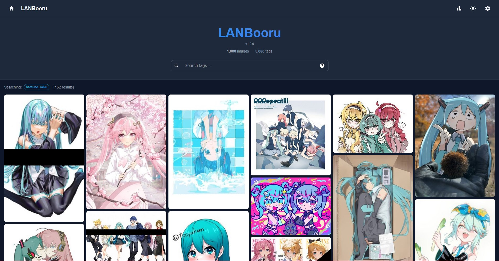
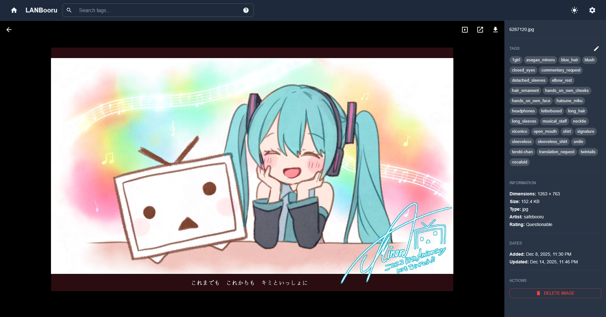

# LANBooru

*A simple self-hosted image gallery with booru-like searching and tagging.*

LANBooru lets you organize your local image and video collection with tags, then find exactly what you're looking for with a single search. Just add your existing folders and it handles the rest.



## Main Features

- **Tag-based organization** - Add tags to images and videos, search by any combination
- **Powerful search** - Boolean logic (AND/OR/NOT), wildcards, grouping, and metadata filters
- **Folder scanning** - Just point LANBooru at your existing image folders, and it'll index them automatically
- **Duplicate detection** - Finds duplicate images across your collection
- **Video support** - Tag and search videos alongside images
- **Plugin system** - Extend functionality with plugins (for example, AI tagging or image analytics!)
- **Runs anywhere** - Docker-based setup works on Windows, Mac, and Linux

## Quick Start

1. **Install Docker** - [Get Docker](https://docs.docker.com/get-docker/) if you don't have it

2. **Clone the repository**
   ```bash
   git clone https://github.com/EK720/lanbooru.git
   cd lanbooru
   ```

3. **Configure your environment**
   ```bash
   cp .env.example .env
   ```
   Edit `.env` to set your preferences. The file has comments that explain each option.

4. **Set up folder access**

   Edit `docker-compose.yml` to mount your image folders. Find the `volumes` section under `backend` and adjust for your system:

   ```yaml
   # Linux/Mac - mount home directory
   - ${HOME}:/host:rw

   # Windows - mount C: drive
   - C:\:/host:rw
   ```

5. **Start LANBooru**
   ```bash
   docker compose up -d
   ```

6. **Open your browser** to [http://localhost](http://localhost)

That's it! Add folders through the admin page and LANBooru will start scanning your images.


## Searching

LANBooru uses a booru-style search syntax. Here are the basics:

| Syntax | Description | Example |
|--------|-------------|---------|
| `tag1 tag2` | Match all tags (AND) | `cat cute` |
| `-tag` | Exclude tag | `cat -dog` |
| `~tag1 ~tag2` | Match any tag (OR) | `~cat ~dog` |
| `tag*` | Wildcard | `anim*` matches "anime", "animal" |
| `rating:safe` | Filter by rating | `rating:s`, `rating:q`, `rating:e` |
| `sort:random` | Change sort order | `sort:date_asc`, `sort:size` |

Use `{ }` to group tags: `~{cat cute} ~{dog playful}` finds images with (cat AND cute) OR (dog AND playful).

For the full search reference, click the **?** icon in the search bar or go to [http://localhost/help](http://localhost/help).

## Image View

Click any image to see its details, edit tags, and view metadata.



## Plugins

LANBooru's plugin system lets you extend its functionality:

- **Builtin plugins** - Simple hooks that run inside LANBooru (e.g. tag formatting or validation)
- **Container plugins** - Isolated Docker services for heavy processing (like AI tagging or auto-filtering)
- **External plugins** - Connect to services you run yourself

Example plugins (in /example-plugins) include an AI auto-tagger and a collection analyzer.

See [PLUGINS.md](docs/PLUGINS.md) for the full plugin development guide.

## Troubleshooting

**Images not appearing after adding a folder**

Folders are scanned on an interval (default 15 minutes). You can trigger an immediate scan by clicking the refresh button next to the folder in the admin page, or restarting LANBooru.

**"Permission denied" errors on Linux**

Make sure your image folders are readable by Docker. You may need to adjust permissions or run Docker with appropriate user mapping.

**Can't access LANBooru from another device**

By default, LANBooru binds to all interfaces but your firewall may block access. Check your firewall settings to allow connections on the configured port. Some EAP networks (these usually have a login page after joining) also might isolate devices, not allowing any cross-device/LAN access.
(If someone finds a solution to the EAP problem, please let me know.)

## Contributing

Found a bug or have a feature request? [Open an issue](https://github.com/EK720/LANBooru/issues) on GitHub.

## License


This project is licensed under the [GNU GPL Version 3](https://www.gnu.org/licenses/gpl-3.0.en.html#license-text).
